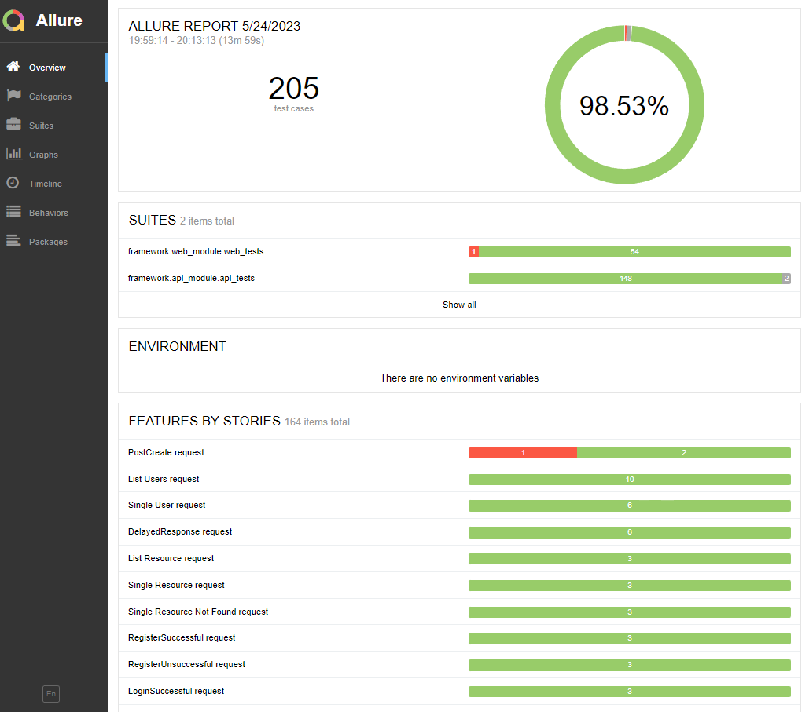
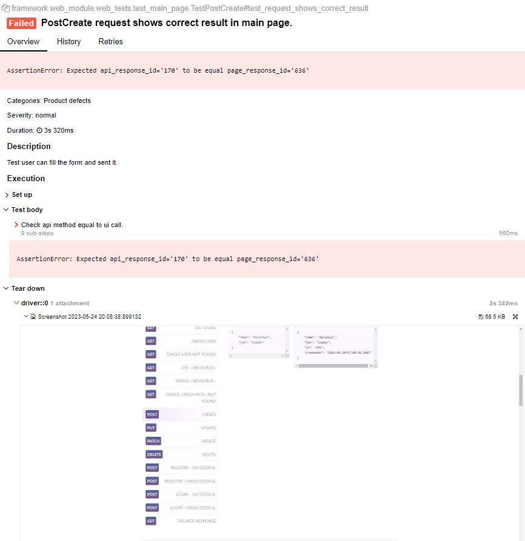

# IBS-company-test-task

Reqres API and WEB

https://reqres.in/ - Открытое API
Необходимо на Python + PyTest написать тесты, где реализовать следующие пункты:

1) Написать позитивные и негативные API тесты, которые представлены на главной странице как образец.
2) Написать WEB тесты с главной страницы + добавить проверку, что при нажатии на кнопку отправки образца запроса,
   получаемый результат (тело ответа и статус код) такой же, как и через API запрос.
3) Все тесты параметризировать и добавить фикстуры.
4) Добавить возможность масштабировать проект (К примеру: если в WEB - добавится новая страница, а в API добавится новая
   версия API. То в таком случае добавляется новый класс и не нарушается текущая реализация).

## Used tools:

+ [Python 3.11.3](https://www.python.org/downloads/) - program language
+ [pytest](https://docs.pytest.org/en/7.3.x/) - test runner
+ [selenium](https://pypi.org/project/selenium/) - API for SeleniumWebDriver
+ [webdriver-manager](https://github.com/SergeyPirogov/webdriver_manager) - for webdrivers (no more driver installations
  needed)
+ [Allure](https://github.com/allure-framework/allure-python) - test report framework
+ [Faker](https://pypi.org/project/Faker/) - for test data generation

## To run tests use following instructions:

1. Install Allure
2. Add Allure to PATH if you are using Windows OS
3. Install requirements:

```shell
pip install -r requirements.txt
```

4. Start tests. Use the following command from project root:

```shell
pytest --alluredir=allure_results .\framework
```

5. After all tests complited you can check allure report:

```shell
allure serve allure_results
```

### I added Complited Allure report so you could see it at the beggining

Just use the following command from project root:

```shell
allure serve allure_results
```

Total review



Failed API-to-UI test



## You can check my other projects

1. [Cross browser, multi-language UI testing with Selenium, pytest and pytest-html as report forming lybrary](https://github.com/Lexxx42/final_test_project)
2. [A lot of different UI tests with Selenium, pytest, allure and test-data generation](https://github.com/Lexxx42/testing_framework_selenium_pytest)
3. [API testing with pytest, JavaScript and Python automation](https://github.com/Lexxx42/testing-api-telegram)

## Stay tuned!
